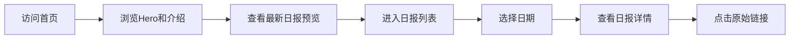

## 1. 产品概述

AI前沿观察者是一个每日自动收集并生成AI领域前沿技术动态的项目。本官网旨在展示项目价值，提供每日AI技术日报的在线浏览入口，让用户可以直观地查看历史报告和最新AI技术突破。

- 核心价值：聚合全球顶级AI机构（OpenAI、Google DeepMind、Anthropic等）的最新技术突破，每日自动生成结构化日报
- 目标用户：AI研究者、开发者、技术爱好者、行业从业者
- 产品目标：打造专业、高效、美观的AI技术信息获取平台

## 2. 核心功能

### 2.1 用户角色

| 角色 | 注册方式 | 核心权限 |
|------|----------|----------|
| 访客用户 | 无需注册 | 浏览日报列表、查看报告详情、了解项目介绍 |

### 2.2 功能模块

1. **首页**：Hero展示区、项目介绍、最新日报预览、功能特性
2. **日报列表页**：历史日报列表、日期筛选、报告数量统计
3. **日报详情页**：完整报告内容展示、新闻条目卡片、来源链接

### 2.3 页面详情

| 页面名称 | 模块名称 | 功能描述 |
|----------|----------|----------|
| 首页 | Hero区域 | 项目名称、标语、动态背景效果、进入日报按钮 |
| 首页 | 项目介绍 | 项目简介、工作原理、数据来源说明 |
| 首页 | 最新日报 | 展示最近一天的日报摘要，点击查看详情 |
| 首页 | 功能特性 | 四大核心特性卡片展示 |
| 日报列表页 | 日期导航 | 按日期倒序排列的日报列表 |
| 日报列表页 | 统计信息 | 总报告数、累计新闻条数等数据展示 |
| 日报详情页 | 报告头部 | 日期、报告生成时间、新闻数量 |
| 日报详情页 | 新闻列表 | 每条新闻以卡片形式展示，包含标题、来源、摘要、链接 |

## 3. 核心流程

用户访问首页 → 浏览项目介绍和最新日报预览 → 点击进入日报列表 → 选择日期查看具体日报 → 阅读新闻详情并点击原始链接

## 4. 用户界面设计

### 4.1 设计风格

- **主色调**：深邃科技蓝（#0A1628）搭配电光青（#00D4FF）作为强调色，营造前沿科技感
- **辅助色**：深紫（#7C3AED）用于渐变点缀，丰富视觉层次
- **背景风格**：深色主题 + 渐变网格 + 微光粒子效果，体现AI技术的未来感
- **按钮风格**：圆角矩形，带有发光悬停效果，渐变填充
- **字体**：展示字体使用 Space Grotesk，正文字体使用 JetBrains Mono，营造技术极客氛围
- **布局风格**：卡片式布局，玻璃拟态效果，分层阴影
- **图标风格**：线性图标，搭配发光效果

### 4.2 页面设计概览

| 页面名称 | 模块名称 | UI元素 |
|----------|----------|--------|
| 首页 | Hero区域 | 大标题渐变色、动态背景粒子、打字机效果标语、发光CTA按钮 |
| 首页 | 项目介绍 | 左右分栏布局，玻璃拟态卡片，图标动画 |
| 首页 | 最新日报 | 大卡片展示，日期标签，新闻条目列表，查看详情按钮 |
| 首页 | 功能特性 | 四列卡片网格，悬停上浮效果，图标发光 |
| 日报列表页 | 列表区域 | 时间轴样式，日期卡片，悬停展开摘要 |
| 日报详情页 | 内容区域 | 报告头部信息，新闻卡片列表，来源标签，链接按钮 |

### 4.3 响应式设计

- 设计原则：Desktop-first，移动端自适应
- 断点设置：1200px（桌面）、768px（平板）、480px（手机）
- 移动端优化：卡片单列布局、导航简化为汉堡菜单、字体大小适配
- 触摸优化：按钮最小尺寸44px，列表项增加点击区域

### 4.4 动效设计

- 页面加载：元素渐入 + 上移动画，错峰延迟
- 滚动效果：滚动触发元素渐显，视差背景
- 悬停效果：卡片上浮、发光边框、图标放大
- 文字效果：标题渐变流光、数字滚动计数
- 背景粒子：缓慢漂浮的光点，鼠标跟随微动
