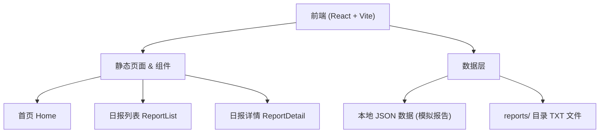

## 1. 架构设计



## 2. 技术选型说明

- **前端框架**：React@18 + TypeScript
- **构建工具**：Vite@5
- **样式方案**：TailwindCSS@3 + CSS 变量
- **路由管理**：React Router@6
- **图标库**：Lucide React
- **动画方案**：CSS Animations + Framer Motion
- **数据来源**：本地 reports 目录下的 TXT 报告文件（构建时转换为 JSON）

## 3. 目录结构

```
frontend/
├── src/
│   ├── components/        # 公共组件
│   │   ├── Header.tsx    # 导航头部
│   │   ├── Footer.tsx    # 页脚
│   │   ├── NewsCard.tsx  # 新闻卡片
│   │   └── ParticleBg.tsx # 粒子背景
│   ├── pages/            # 页面组件
│   │   ├── Home.tsx      # 首页
│   │   ├── ReportList.tsx # 日报列表页
│   │   └── ReportDetail.tsx # 日报详情页
│   ├── data/             # 数据文件
│   │   └── reports.ts    # 报告数据（从TXT解析）
│   ├── types/            # 类型定义
│   │   └── index.ts
│   ├── App.tsx           # 应用入口
│   ├── main.tsx          # React 入口
│   └── index.css         # 全局样式
├── public/               # 静态资源
├── index.html
├── package.json
├── vite.config.ts
└── tailwind.config.js
```

## 4. 路由定义

| 路由路径 | 页面名称 | 说明 |
|----------|----------|------|
| / | 首页 | 项目介绍、最新日报预览、功能特性 |
| /reports | 日报列表页 | 历史日报列表、统计信息 |
| /reports/:date | 日报详情页 | 指定日期的完整报告内容 |

## 5. 数据模型

### 5.1 数据类型定义

```typescript
interface NewsItem {
  id: number;
  title: string;
  source: string;
  summary: string;
  link: string;
}

interface DailyReport {
  date: string;           // 格式：YYYY-MM-DD
  displayDate: string;    // 显示格式：YYYY年MM月DD日
  generatedAt: string;    // 生成时间
  newsCount: number;      // 新闻数量
  news: NewsItem[];       // 新闻列表
}
```

### 5.2 数据解析方案

- 从 `reports/` 目录读取所有 `ai_report_YYYYMMDD.txt` 文件
- 解析 TXT 文件格式，提取日期、新闻条目等信息
- 构建为结构化的 JSON 数据供前端使用
- 按日期倒序排列

## 6. 核心组件说明

| 组件名 | 职责 | 关键特性 |
|--------|------|----------|
| ParticleBg | 动态粒子背景 | Canvas 绘制、鼠标跟随、性能优化 |
| NewsCard | 新闻卡片 | 玻璃拟态、悬停动效、来源标签 |
| Header | 导航栏 | 滚动变色、响应式菜单 |
| HeroSection | 首页Hero | 渐变文字、打字机效果、发光按钮 |
| FeatureCard | 特性卡片 | 图标动画、悬停上浮 |
| ReportTimeline | 日报时间轴 | 时间轴样式、展开/收起 |
